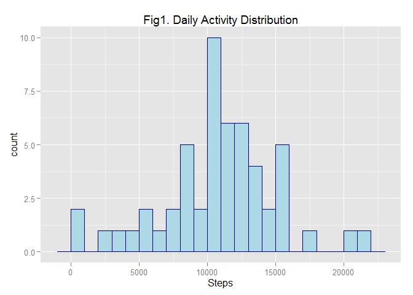
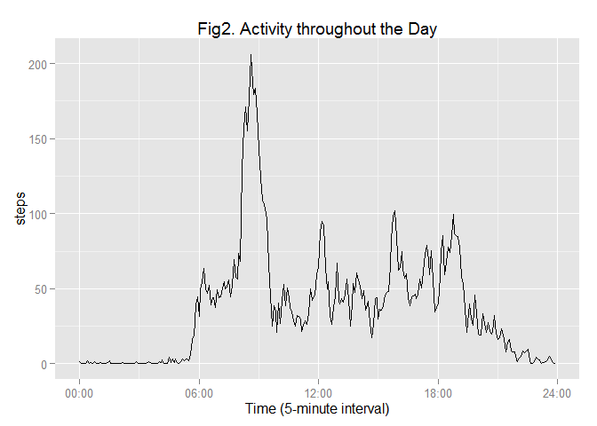
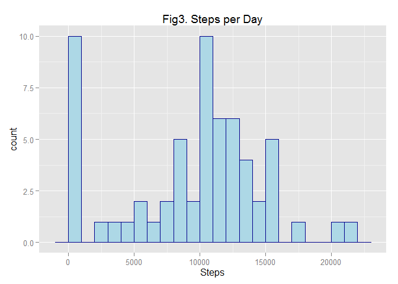

# Reproducible Research: Peer Assessment 1
     Author: Dann Hekman
     Date  : 2015-04-29

## Loading and preprocessing the data
Our data are provided by Data Science Specialization professors on the Courera [class website](https://d396qusza40orc.cloudfront.net/repdata%2Fdata%2Factivity.zip) and come from a personal activity monitoring device.  

This device collects data at 5 minute intervals through out the day. The dataset consists of two months of data from an anonymous individual collected during the months of October and November, 2012 and include the number of steps taken in 5 minute intervals each day.

For preprocessing, we must load the data into a data frame in R, and make sure R views the dates and intervals as the correct classes for further processing.  

```r
#Assume we've got the correct working directory.
#Load the libraries we'll need to use later
if (!require(ggplot2)) install.packages("ggplot2")
```

```
## Loading required package: ggplot2
```

```r
if (!require(plyr)) install.packages("plyr")
```

```
## Loading required package: plyr
```

```r
if (!require(chron)) install.packages("chron")
```

```
## Loading required package: chron
```

```r
library(ggplot2);library(plyr);library(chron) 
activity <- read.csv("activity.csv")
summary(activity) #What are we looking at here?
```

```
##      steps                date          interval     
##  Min.   :  0.00   2012-10-01:  288   Min.   :   0.0  
##  1st Qu.:  0.00   2012-10-02:  288   1st Qu.: 588.8  
##  Median :  0.00   2012-10-03:  288   Median :1177.5  
##  Mean   : 37.38   2012-10-04:  288   Mean   :1177.5  
##  3rd Qu.: 12.00   2012-10-05:  288   3rd Qu.:1766.2  
##  Max.   :806.00   2012-10-06:  288   Max.   :2355.0  
##  NA's   :2304     (Other)   :15840
```

```r
activity$date <- as.Date(as.character(activity$date))
activity$interval <- times(gsub('^([0-9]{2})([0-9]+)$', '\\1:\\2:00', formatC(activity$interval,wid=4,fla="0")))
```
  
As we can see, this dataset has three columns:  
* Steps - the number of steps taken during the interval.  
* Date - the date on which the steps were taken in ISO format, which I've converted to R's native `as.Date` format.  
* Interval - the start time of the five minute interval during the day during which the steps were taken in 24-hour HHMM format. I've used the [chron package](http://cran.r-project.org/web/packages/chron/chron.pdf) to format these as times.  


## What is mean total number of steps taken per day?
We want to identify the mean number of steps taken over the whole day, so we need to aggregate over the all the intervals on a given day. To do this, we used the ddply function in the [plyr](http://cran.r-project.org/web/packages/plyr/index.html) R package to summarize the steps per day.

Once we have the data summarized by date across all intervals, we use ggplot2 to create a histogram showing the distribution of steps per day and calculate the mean and median across all days, ignoring NA values.

```r
#First, let's get the data aggregated by day
activity.byDay <- ddply(activity,.(date),summarize,steps=sum(steps))
#Second,Let's look at what we have
head(activity.byDay)
```

```
##         date steps
## 1 2012-10-01    NA
## 2 2012-10-02   126
## 3 2012-10-03 11352
## 4 2012-10-04 12116
## 5 2012-10-05 13294
## 6 2012-10-06 15420
```

```r
hist<-ggplot(data=activity.byDay,
             aes(x=steps))
hist<-hist+
     geom_histogram(colour="darkblue",fill="lightblue", binwidth=1000) +      
     xlab("Steps") +
     ggtitle("Fig1. Daily Activity Distribution")
hist
```

 

```r
#Third, let's get the Mean and Median by Day
avg<-mean(activity.byDay$steps,na.rm=TRUE) ; avg
```

```
## [1] 10766.19
```

```r
med<-median(activity.byDay$steps,na.rm=TRUE) ; med
```

```
## [1] 10765
```
We can see that the number of steps taken daily is approximately symetrical with mean 10766.2 and median 10765 steps.  
  
  
## What is the average daily activity pattern?
Instead of summarizing by day as we did previously, we can also summarize by interval. As before, we use the plyr and ggplot2 packages to aggregate and look at the data. 

Then we use core R functions to identify the interval with the most steps and convert that interval to a human-readable time.


```r
#First, let's get summarize the daily data into something overtime
activity.byInt <- ddply(activity,.(interval),summarize,steps=mean(steps,na.rm=TRUE))
#Second, let's look at what we have
line<-qplot(data=activity.byInt,
             x=interval,
             y=steps,group=1,geom="line") + 
             xlab("Time (5-minute interval)") +     
             ggtitle("Fig2. Activity throughout the Day") +
             scale_x_continuous(labels=c("00:00","06:00","12:00","18:00","24:00"))
line
```

 

```r
#Third, find the maximum average interval
maxIndex <- which.max(activity.byInt$steps)
maxSteps <- activity.byInt$steps[maxIndex]; maxSteps
```

```
## [1] 206.1698
```

```r
maxIntvl <- activity.byInt$interval[maxIndex]; maxIntvl
```

```
## [1] 08:35:00
```
So on average, activity peaks between 08:35:00 AM and 08:40:00 AM with an average of 206.2 steps during that 5 minute period.  

## Imputing missing values
In the two previous examples, we just ignored NA values, but what if we were to calculate the NA values based on the surrounding data?

To do this, we will loop through all the steps rows, and for each missing value, we will calculate the presumed number of steps based on the number of steps in the two surrounding values. If either value is NA, then we will impute 0 steps for that row, otherwise we will impute the arithmetic mean of the preceeding and following rows.

For example, suppose we had the following step data:  
NA, NA, 20, 5, 0, NA, NA, 5, 20, NA, 20

This algorithm would impute values for the NAs such that our obersvations would look like this:  
**0**, **10**, 20, 5, 0, **0**, **2.5**, 5, 20, **20**, 20

Then, we will re-answer question 1 regarding mean/median steps per day with the filled in dataset.  


```r
#How many NA Values do we have?
sum(is.na(activity$steps))
```

```
## [1] 2304
```

```r
#Strategy for filling in NA Value: mean of previous and subsequent intervals
activity_sansNA <- activity
for (i in 1:nrow(activity_sansNA)) {
     if (is.na(activity_sansNA$steps[i])) {
          preVal <- activity_sansNA$steps[i-1]
          nxtVal <- activity_sansNA$steps[i+1]
          newVal <- mean(c(preVal,nxtVal),na.rm=TRUE)
          if (is.nan(newVal)) {activity_sansNA$steps[i] <- 0}
          else {activity_sansNA$steps[i] <- newVal}  
          
     }
}
summary(activity_sansNA)
```

```
##      steps             date               interval       
##  Min.   :  0.00   Min.   :2012-10-01   Min.   :00:00:00  
##  1st Qu.:  0.00   1st Qu.:2012-10-16   1st Qu.:05:58:45  
##  Median :  0.00   Median :2012-10-31   Median :11:57:30  
##  Mean   : 32.48   Mean   :2012-10-31   Mean   :11:57:30  
##  3rd Qu.:  0.00   3rd Qu.:2012-11-15   3rd Qu.:17:56:15  
##  Max.   :806.00   Max.   :2012-11-30   Max.   :23:55:00
```

```r
#First, let's get the data aggregated by day
activity.byDay2 <- ddply(activity_sansNA,.(date),summarize,steps=sum(steps))
#Second,Let's look at what we have
head(activity.byDay2)
```

```
##         date steps
## 1 2012-10-01     0
## 2 2012-10-02   126
## 3 2012-10-03 11352
## 4 2012-10-04 12116
## 5 2012-10-05 13294
## 6 2012-10-06 15420
```

```r
hist2<-ggplot(data=activity.byDay2,
              aes(x=steps))
hist2<-hist2+geom_histogram(colour="darkblue",fill="lightblue", binwidth=1000) + xlab("Steps") + ggtitle("Fig3. Steps per Day")
hist2
```

 

```r
#Third, let's get the Mean and Median by Day
mean(activity.byDay2$steps,na.rm=TRUE)
```

```
## [1] 9354.23
```

```r
median(activity.byDay2$steps,na.rm=TRUE)
```

```
## [1] 10395
```
We can see that generally speaking, if a day has any NAs, most of that day is NA, which makes sense given our data source. If a person forgets to wear his or her pedometer, then that will register as 0 steps for that day. For obvious reasons, the mean is much more affected by the increased number of days with 0 steps than the median is.  

## Are there differences in activity patterns between weekdays and weekends?
To see if there are any differences in behavior on the weekend vs. weekday (as we expect there would be), we can create a new column and use ggplot2's `color` parameter to distinguish between average weekday or weekend activity.


```r
#First, add a column for weekend vs weekday
isweekend<-factor(weekdays(as.Date(activity_sansNA$date)) %in% c('Saturday','Sunday'),labels=c("Weekend","Weekday"))
activity_sansNA<-cbind(activity_sansNA,isweekend)
#Second, sum up steps
activity.byInt2 <- aggregate(steps ~ interval + isweekend,data=activity_sansNA,mean)
#And plot it
line2<-qplot(data=activity.byInt2,
              x=interval,
              y=steps,geom="line",
              color=isweekend) +
              ggtitle("Fig4. Activity throughout the Day") + 
              xlab("Time (5-minute interval)") +
             scale_x_continuous(labels=c("00:00","06:00","12:00","18:00","24:00"))
line2
```

 
We can see from this graph that our annonymous pedometer wearer is slightly more active on weekdays, but tends to rise earlier on weekends, and is also more likely to take what appears to be an 8:30 AM jog. 


###Appendix: Save off figures
Per the project guidelines, we also need to save off the figures to their own directory.  

```r
if (file.exists("./figures")) {setwd("./figures")
} else {dir.create("./figures") ; setwd("./figures")}

png(file="Figure1.png"); hist; dev.off()   
png(file="Figure2.png"); line; dev.off()   
png(file="Figure3.png"); hist2; dev.off() 
png(file="Figure4.png"); line2; dev.off() 
setwd("..") #go back to original directory
```
